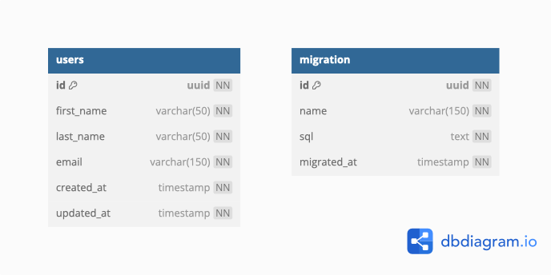

# Users Service

## Objective:

This service is responsible for managing users. It provides APIs to create, read, update, delete, and list users.

## Key Technologies:

- [Java](https://java.com)
- [PostgreqSQL](https://postgresql.org)
- [Docker](https://docker.com)
- [Kubernetes](https://kubernetes.io)

## Creating the Docker image:

To create the Docker image, you need to have Docker installed on your system. Navigate to the root directory of this project and run the following command:

```shell
docker build -t users-backend .
```

The command will create a Docker image named `users-backend` from the Dockerfile in the root directory.

## Generating version tags:

The project uses `RichardInnocent/semantic-versioning-maven` GitHub Actions to automatically increment version numbers and generate tags.

It is necessary to ensure that the commit generated by the Pull Request to the `main` branch contains the prefix below according to the type of version being generated.

| Prefix     | Type of increment | Original version | New version |
|------------|-------------------|------------------|-------------|
| `feat()!:` | Major             | `1.0.0`          | `2.0.0`     |
| `fix()!:`  | Major             | `1.0.0`          | `2.0.0`     |
| `feat():`  | Minor             | `1.0.0`          | `1.1.0`     |
| `fix():`   | Patch             | `1.0.0`          | `1.0.1`     |
| Any other  | None              | `1.0.0`          | `1.0.0`     |

## Running the application with Docker:

Finally, run the following command in the root directory of this project:

```bash
docker compose up -d
```

The command will start a container from the `users-backend` image, with all the necessary environment variables configured previously.

## Additional information:

- [Entity Relationship Diagram](./docs/erd.dbml)



## Development:

Made with &hearts; by Ivan Wilhelm.

Coded in [IntelliJ IDEA Community](https://www.jetbrains.com/idea/) by [JetBrains](https://www.jetbrains.com)
